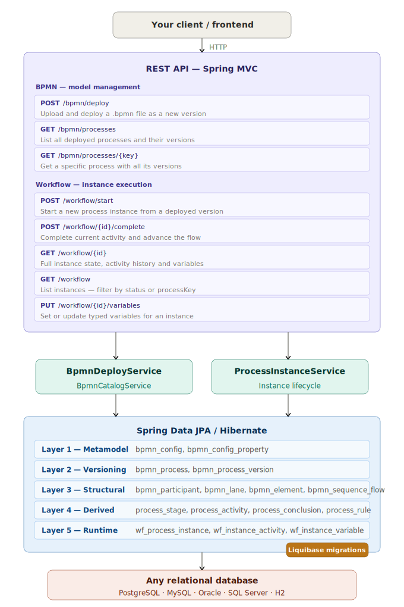

# bpmnflow-process-runtime

> **Deploy BPMN. Start instances. Advance step by step. Query everything.**
> The production-ready runtime that turns your `.bpmn` diagrams into a fully persisted, versioned, REST-driven workflow engine.

[](https://openjdk.org/projects/jdk/21/)
[](https://spring.io/projects/spring-boot)
[](https://www.liquibase.org/)
[](https://h2database.com/)
[](LICENSE)

---

## Why this project exists

Most BPMN tools give you two extremes: a full-blown BPM platform (Camunda, Flowable) with its own runtime engine, proprietary database schema, job executors, and years of learning curve — or nothing at all, just a parser with no persistence.

`bpmnflow-process-runtime` sits precisely in between.

It is a **reference runtime implementation** for the [BPMNFlow ecosystem](#ecosystem) — a lightweight alternative that gives you:

- **Full persistence** of the model, all its structural elements, and every execution event
- **Versioning** — deploy a new `.bpmn` and old running instances keep working on their original version
- **REST-first** — every operation is a plain HTTP call, with a Swagger UI included
- **Any relational database** — the schema uses only portable Liquibase primitive types (`BIGINT`, `VARCHAR`, `BOOLEAN`, `DATETIME`, `CLOB`), compatible with Oracle (19c, 21c, 23ai — driver already bundled), PostgreSQL, MySQL, MariaDB, SQL Server, H2, and others. The choice is yours.
- **A schema you understand** — 5 clear layers, from metamodel to runtime, fully documented and queryable with plain SQL

---

## Ecosystem

BPMNFlow is a three-layer ecosystem. Each layer has a single responsibility:

| Repository | Role |
|---|---|
| [bpmnflow-core](https://github.com/jefersonferr/bpmnflow-core) | Pure BPMN parser — reads `.bpmn` + YAML config, returns a `Workflow` object with activities, rules, stages, and inconsistencies. No state, no database, no Spring. |
| [bpmnflow-spring-boot-starter](https://github.com/jefersonferr/bpmnflow-spring-boot-starter) | Spring Boot auto-configuration — injects a `WorkflowEngine` bean, exposes `/process/**` for in-memory model navigation, supports hot-swap without restart. |
| **bpmnflow-process-runtime** | **This project** — full persistence, multi-version deploy, REST-driven instance lifecycle, typed variables, activity history. Works with any relational database via Liquibase. |
| [bpmnflow-spring-boot-demo](https://github.com/jefersonferr/bpmnflow-spring-boot-demo) | In-memory demo using the starter — no database required, good for exploring the API quickly. |

Use `bpmnflow-process-runtime` when you need a **real, persisted workflow engine** that your team controls end to end.

---

## How it works — the full picture



### What happens when you deploy a `.bpmn`

1. `bpmnflow-core` parses the model — extracts stages, activities, conclusions, rules, and inconsistencies (Layer 4 — derived data).
2. A DOM parser reads the raw XML — persists participants, lanes, elements, sequence flows, and all Camunda extension properties (Layer 3 — structural data).
3. The YAML config is hashed and stored — enabling different processes to use different configs and the same process to evolve its config over time (Layer 1).
4. A new process version is created — old instances keep running on their original version (Layer 2).
5. The in-memory `WorkflowEngine` is updated atomically via `AtomicReference`.

### What happens when you run a process instance

1. `startProcess` finds the `START_TO_TASK` rule for the version and creates the first activity step.
2. Each `completeActivity` call marks the current step as completed with the given conclusion code, resolves the matching rule, and creates the next step — or marks the instance as `COMPLETED` if the rule leads to an end event.
3. Every step is persisted in `wf_instance_activity` with timestamps — full audit trail.
4. Variables are validated by type before persisting — a declared `INTEGER` rejects `"abc"` at the API boundary.

---

## Prerequisites

| Requirement | Minimum |
|---|---|
| Java | 21 |
| Maven | 3.8+ |
| Database | Any relational database supported by Hibernate and Liquibase |

No external database is required to run tests or explore the project locally — H2 is included and configured out of the box.

---

## Getting Started

### 1. Clone

```bash
git clone https://github.com/jefersonferr/bpmnflow-process-runtime.git
cd bpmnflow-process-runtime
```

### 2. Run locally with H2 (no external database needed)

```bash
mvn spring-boot:run -Dspring-boot.run.profiles=h2
```

H2 data persists between restarts in `~/bpmnflow-runtime.mv.db`. The H2 console is available at `http://localhost:8080/h2-console`.

Swagger UI: [http://localhost:8080/swagger-ui.html](http://localhost:8080/swagger-ui.html)

### 3. Connect to your database of choice

Edit `src/main/resources/application.yaml` with your JDBC datasource and the matching Hibernate dialect:

**Oracle (driver already included — no extra dependency needed):**
```yaml
spring:
  datasource:
    url: jdbc:oracle:thin:@//host:1521/service
    username: your_user
    password: your_password
  jpa:
    database-platform: org.hibernate.dialect.OracleDialect
```

The Oracle JDBC driver (`ojdbc11`), PKI support (`oraclepki`), and NLS library (`orai18n`) are already declared in `pom.xml` — no additional dependency required. Compatible with Oracle 19c, 21c, and 23ai.

**PostgreSQL:**
```yaml
spring:
  datasource:
    url: jdbc:postgresql://localhost:5432/bpmnflow
    username: your_user
    password: your_password
  jpa:
    database-platform: org.hibernate.dialect.PostgreSQLDialect
```

**MySQL / MariaDB:**
```yaml
spring:
  datasource:
    url: jdbc:mysql://localhost:3306/bpmnflow
    username: your_user
    password: your_password
  jpa:
    database-platform: org.hibernate.dialect.MySQLDialect
```

**SQL Server:**
```yaml
spring:
  datasource:
    url: jdbc:sqlserver://localhost:1433;databaseName=bpmnflow
    username: your_user
    password: your_password
  jpa:
    database-platform: org.hibernate.dialect.SQLServerDialect
```

For databases other than Oracle, add the corresponding JDBC driver to `pom.xml` and run:

```bash
mvn spring-boot:run
```

Liquibase automatically applies all 5 migration scripts on first startup — no manual DDL required, no setup scripts to run. The changelogs use only portable primitive types, so Liquibase translates the correct DDL syntax for your target database automatically.

---

## API Reference

### Deploy — Model Management

| Method | Endpoint | Description |
|--------|----------|-------------|
| `POST` | `/bpmn/deploy` | Upload and deploy a `.bpmn` file (multipart). Accepts an optional config YAML. Each call to the same `processKey` creates a new version. |
| `GET` | `/bpmn/processes` | List all deployed processes with their versions and structural counters. |
| `GET` | `/bpmn/processes/{processKey}` | Get a specific process with all versions ordered newest-first. |

**Deploy example:**

```bash
# With default config (classpath bpmn-config.yaml)
curl -X POST http://localhost:8080/bpmn/deploy \
  -F "bpmn=@pizza-delivery.bpmn" \
  -F "processKey=PIZZA_DELIVERY"

# With a custom config file
curl -X POST http://localhost:8080/bpmn/deploy \
  -F "bpmn=@my-process.bpmn" \
  -F "config=@my-config.yaml" \
  -F "processKey=MY_PROCESS"
```

**Deploy response:**

```json
{
  "message": "Model deployed successfully",
  "processKey": "PIZZA_DELIVERY",
  "versionId": 1,
  "versionNumber": 1,
  "versionTag": "1.0.0",
  "valid": true,
  "participantCount": 1,
  "laneCount": 4,
  "elementCount": 14,
  "sequenceFlowCount": 18,
  "stageCount": 4,
  "activityCount": 9,
  "ruleCount": 12,
  "inconsistencyCount": 0,
  "inconsistencies": []
}
```

---

### Workflow — Instance Execution

| Method | Endpoint | Description |
|--------|----------|-------------|
| `POST` | `/workflow/start?versionId={id}` | Start a new process instance from a deployed version. Accepts an optional external correlation ID and initial variables. |
| `POST` | `/workflow/{instanceId}/complete` | Complete the current activity with a conclusion code and advance to the next step. |
| `GET` | `/workflow/{instanceId}` | Full instance state: current activity, available conclusions, activity history, and all variables. |
| `GET` | `/workflow` | List instances. Filter by `status` (`ACTIVE`, `COMPLETED`) and/or `processKey`. |
| `PUT` | `/workflow/{instanceId}/variables` | Set or update typed variables. Validates value against the declared type. |
| `GET` | `/workflow/{instanceId}/variables` | Get all instance variables with their raw and converted values. |

**Start a process:**

```bash
curl -X POST "http://localhost:8080/workflow/start?versionId=1" \
  -H "Content-Type: application/json" \
  -d '{
    "externalId": "ORDER-001",
    "variables": [
      {"key": "customer", "type": "STRING", "value": "John"},
      {"key": "total",    "type": "FLOAT",  "value": "42.50"}
    ]
  }'
```

**Advance with a conclusion:**

```bash
curl -X POST "http://localhost:8080/workflow/1/complete" \
  -H "Content-Type: application/json" \
  -d '{"conclusionCode": "ORDER_CONFIRMED"}'
```

**Get full instance state:**

```bash
curl http://localhost:8080/workflow/1
```

```json
{
  "instanceId": 1,
  "externalId": "ORDER-001",
  "instanceStatus": "ACTIVE",
  "processStatus": "IN_PROGRESS",
  "versionId": 1,
  "versionNumber": 1,
  "currentActivity": {
    "stepNumber": 3,
    "abbreviation": "KT-BAK",
    "activityName": "Bake Pizza",
    "stageCode": "KT",
    "laneName": "Kitchen",
    "availableConclusions": [
      {"code": "READY_FOR_DELIVERY", "name": "Pizza is ready"},
      {"code": "NOT_READY",          "name": "Needs more time"}
    ]
  },
  "activityHistory": [
    {"stepNumber": 1, "abbreviation": "CS-SEL", "status": "COMPLETED", "conclusionCode": null},
    {"stepNumber": 2, "abbreviation": "CS-ORD", "status": "COMPLETED", "conclusionCode": "ORDER_CONFIRMED"},
    {"stepNumber": 3, "abbreviation": "KT-BAK", "status": "ACTIVE"}
  ],
  "variables": [
    {"key": "customer", "type": "STRING", "value": "John",  "convertedValue": "John"},
    {"key": "total",    "type": "FLOAT",  "value": "42.50", "convertedValue": 42.5}
  ]
}
```

---

## Variable Types

Variables are stored as text and validated + converted by declared type at both write and read time.

| Type | Java type | Valid values |
|------|-----------|--------------|
| `STRING` | `String` | Any value |
| `INTEGER` | `Long` | Parseable as long integer |
| `FLOAT` | `Double` | Parseable as double |
| `BOOLEAN` | `Boolean` | `true`/`false`, `1`/`0`, `yes`/`no` |
| `DATE` | `LocalDate` | Format `yyyy-MM-dd` |
| `JSON` | `JsonNode` | Any valid JSON string |

Type mismatches return HTTP 400 immediately — validation happens before any write.

---

## Database Schema

Schema is managed entirely by **Liquibase**. All changelogs live in `src/main/resources/db/changelog/` and use only portable primitive types — no vendor-specific DDL anywhere. Liquibase applies them automatically on startup against whichever database you configure.

| File | Layer | Tables |
|------|-------|--------|
| `V001__metamodel.yaml` | 1 — Metamodel | `bpmn_config`, `bpmn_config_property` |
| `V002__process_versioning.yaml` | 2 — Versioning | `bpmn_process`, `bpmn_process_version` |
| `V003__structural_layer.yaml` | 3 — Structural | `bpmn_participant`, `bpmn_lane`, `bpmn_element`, `bpmn_sequence_flow`, `bpmn_extension_property` |
| `V004__derived_data.yaml` | 4 — Derived | `process_stage`, `process_activity`, `process_conclusion`, `process_rule`, `process_inconsistency` |
| `V005__runtime.yaml` | 5 — Runtime | `wf_process_instance`, `wf_instance_activity`, `wf_instance_variable` |

### Why 5 layers?

Each layer answers a different question:

- **Layer 1** — "What were the rules for parsing this model?"
- **Layer 2** — "What processes exist, and which version was each instance started on?"
- **Layer 3** — "What does the BPMN diagram actually look like, element by element?"
- **Layer 4** — "What does the engine derive from the diagram — activities, rules, conclusions?"
- **Layer 5** — "What is happening right now — where are instances and what have they done?"

This separation means you can run plain `SELECT` queries across any layer independently, join them for reporting, and evolve each layer's schema without touching the others.

---

## Deployment Versioning

Each call to `POST /bpmn/deploy` with the same `processKey` creates a **new version** — it does not replace the old one.

```
PIZZA_DELIVERY v1  →  running instances 1, 2, 3  (still executing on v1 rules)
PIZZA_DELIVERY v2  →  new instances 4, 5, 6      (executing on v2 rules)
```

Old instances continue executing against the rules and activities of their original version. Only new instances use the latest version. You can deploy process updates with zero disruption to in-flight work.

---

## Running Tests

Tests run entirely against H2 in-memory — no external database required.

```bash
mvn test
```

**What is tested:**

| Suite | Type | What it covers |
|-------|------|----------------|
| `BpmnDeployServiceTest` | Integration (H2 + Liquibase) | Full deploy pipeline, version increments, structural persistence |
| `PizzaDeliveryIntegrationTest` | Integration (H2 + Liquibase) | 4 real end-to-end flow scenarios against the pizza-delivery model |
| `WorkflowFlowTest` | Unit (Mockito) | Step advancement, rule resolution, loop detection |
| `StartProcessTest` | Unit (Mockito) | Instance creation, first activity resolution |
| `VariableTest` | Unit (Mockito) | Variable persistence, upsert behavior |
| `InstanceQueryTest` | Unit (Mockito) | List and get operations, filtering |
| `ConclusionValidationTest` | Unit (Mockito) | Conclusion validation, error messages |
| `VariableTypeTest` | Unit (pure) | All 6 types: valid values, invalid values, conversion |

**Coverage report:**

```bash
mvn test site -DgenerateReports=false
# Report: target/site/jacoco/index.html
```

JaCoCo enforces **75% line coverage and 75% branch coverage** — the build fails if either threshold is not met.

---

## The Pizza Delivery Reference Model

The project ships with `pizza-delivery.bpmn` — a realistic multi-lane BPMN model used throughout the test suite. It is not a toy example. It exercises every feature the engine supports:

```
Stages:    CS (Customer Service)  KT (Kitchen)  DL (Delivery)  FN (Finish)
Activities: CS-SEL  CS-ORD  CS-RCV  CS-CLM
            KT-BAK
            DL-DLV  DL-PMT  DL-RCP
            FN-EAT

Conclusions:
  CS-ORD  →  (none)                — simple sequential step
  CS-RCV  →  ORDER_CONFIRMED       — confirmed path
            NEEDS_ATTENTION       — escalation path
  KT-BAK  →  READY_FOR_DELIVERY   — pizza is done
            NOT_READY             — loop: back to KT-BAK
  DL-DLV  →  COLLECT_PAYMENT      — payment on delivery
            PREPAID               — no payment step needed

Shared gateway: CS-RCV and CS-CLM both feed the same ExclusiveGateway.
Self-loop:      KT-BAK  →NOT_READY→  KT-BAK
```

This model validates the full flow — from deploy → start → multi-step advancement → completion — including the loop and split gateway, in the `PizzaDeliveryIntegrationTest` suite.

---

## Profiles

| Profile | Usage | Database |
|---------|-------|----------|
| _(default)_ | Production / staging | Any database — configure `spring.datasource` in `application.yaml` |
| `h2` | Local development | H2 file-based, persists in `~/bpmnflow-runtime.mv.db` |
| `test` | `mvn test` | H2 in-memory, clean slate per test class |

```bash
# Local development — no external database
mvn spring-boot:run -Dspring-boot.run.profiles=h2

# Production — uses datasource from application.yaml
mvn spring-boot:run
```

---

## Configuration Reference

```yaml
# src/main/resources/application.yaml

server:
  port: 8080

spring:
  datasource:
    url: jdbc:oracle:thin:@//host:1521/service  # Oracle (default — driver bundled)
    username: your_user
    password: your_password
    # For other databases, replace url and dialect below

  jpa:
    database-platform: org.hibernate.dialect.OracleDialect  # match your database
    open-in-view: false
    hibernate:
      ddl-auto: none      # Liquibase owns the schema — Hibernate never touches DDL
    properties:
      hibernate:
        default_batch_fetch_size: 16

  liquibase:
    change-log: classpath:db/changelog/db.changelog-master.yaml
    enabled: true

  jackson:
    default-property-inclusion: non_null
    serialization:
      indent-output: true

# BPMNFlow Starter — controls the in-memory engine
bpmnflow:
  model-path: classpath:pizza-delivery.bpmn
  config-path: classpath:bpmn-config.yaml
  expose-api: true             # exposes /process/** endpoints from the starter

# Swagger UI
springdoc:
  swagger-ui:
    path: /swagger-ui.html
    tags-sorter: alpha
    operations-sorter: method
  paths-to-exclude: /process/model
```

---

## Project Structure

```
bpmnflow-process-runtime/
├── src/
│   ├── main/
│   │   ├── java/org/bpmnflow/runtime/
│   │   │   ├── ProcessRuntimeApplication.java    # Spring Boot entry point
│   │   │   ├── SwaggerConfig.java                # OpenAPI metadata
│   │   │   ├── controller/
│   │   │   │   ├── DeployController.java         # /bpmn/** endpoints
│   │   │   │   └── ProcessController.java        # /workflow/** endpoints
│   │   │   ├── dto/                              # Request and response DTOs
│   │   │   ├── model/entity/                     # JPA entities (all 5 layers)
│   │   │   ├── repository/                       # Spring Data JPA repositories
│   │   │   └── service/
│   │   │       ├── BpmnDeployService.java        # Deploy pipeline (dual-parse)
│   │   │       ├── BpmnCatalogService.java       # Process/version listing
│   │   │       ├── ProcessInstanceService.java   # Instance lifecycle
│   │   │       └── DeployResult.java             # Deploy output value object
│   │   └── resources/
│   │       ├── application.yaml                  # Main config + h2 profile
│   │       ├── pizza-delivery.bpmn               # Reference model
│   │       ├── bpmn-config.yaml                  # Parser/validation config
│   │       └── db/changelog/                     # Liquibase migrations (V001–V005)
│   └── test/
│       ├── java/org/bpmnflow/runtime/service/   # All test suites
│       └── resources/
│           └── application-test.yaml            # H2 in-memory test config
└── pom.xml
```

---

## How this relates to bpmnflow-core and the starter

`bpmnflow-process-runtime` **uses** both upstream libraries — it does not replace them.

The **starter** (`bpmnflow-spring-boot-starter`) auto-configures an in-memory `WorkflowEngine` bean at startup. The runtime uses this bean for two things: loading the default classpath BPMN at startup, and updating the in-memory engine atomically after each deploy (via `AtomicReference<WorkflowEngine>`).

The **core** (`bpmnflow-core`) does the actual BPMN parsing. The runtime calls `ModelParser.parser()` inside `BpmnDeployService` to extract the derived workflow model, and independently uses a DOM parser to extract the raw structural elements. These are two complementary views of the same file:

| View | How | What it captures |
|------|-----|-----------------|
| Semantic (derived) | `bpmnflow-core` / `ModelParser` | Stages, activities, conclusions, rules, inconsistencies |
| Structural (raw) | DOM / `DocumentBuilderFactory` | Every XML element, attribute, extension property, sequence flow |

Both views are persisted, so you can query the database for business-level data ("what activities exist in version 2?") and BPMN-level data ("what element type is this? what are its extension properties?") independently and together.

---

## FAQ

**Which databases are supported?**

Any relational database supported by Hibernate and Liquibase. The schema uses only portable primitive types (`BIGINT`, `VARCHAR`, `BOOLEAN`, `DATETIME`, `CLOB`) with no vendor-specific syntax — Liquibase translates these to the correct DDL for your target database automatically. Oracle (19c, 21c, 23ai), PostgreSQL, MySQL, MariaDB, and SQL Server are all valid choices. The Oracle JDBC driver is already bundled in `pom.xml` — no extra dependency needed. H2 is included for local development and tests and requires zero configuration.

**Can multiple `.bpmn` processes coexist?**

Yes. Each `processKey` is independent. You can deploy `PIZZA_DELIVERY`, `ORDER_FULFILLMENT`, and `CUSTOMER_ONBOARDING` to the same runtime and run instances of each simultaneously.

**What happens if the BPMN model has inconsistencies?**

The deploy still succeeds and the version is created with `valid = false`. The inconsistencies are listed in the deploy response and stored in `process_inconsistency`. You can still start instances from an invalid model — the engine does not block on inconsistencies, giving you visibility without hard failures.

**Can I query process state directly from the database?**

Yes — that is an explicit design goal. The schema is normalized and readable. A running instance's full history is in `wf_instance_activity` ordered by `step_number`. Variables are in `wf_instance_variable`. No proprietary binary serialization anywhere.

**How does hot-swap work?**

When you deploy a new model via `POST /bpmn/deploy`, `BpmnDeployService` calls `engineRef.set(new WorkflowEngineImpl(workflow))`. Any component holding `AtomicReference<WorkflowEngine>` immediately reflects the new model. Components that injected `WorkflowEngine` directly at startup keep the original — which is the intended behavior for in-flight instances.

**Can I use this without Spring Boot?**

This project requires Spring Boot. For a framework-agnostic BPMN parser with no dependencies, see [bpmnflow-core](https://github.com/jefersonferr/bpmnflow-core) directly.

---

## License

MIT License — see [LICENSE](LICENSE).

## Author

[Jeferson Ferreira](https://github.com/jefersonferr)

---

*Part of the BPMNFlow ecosystem:*
*[bpmnflow-core](https://github.com/jefersonferr/bpmnflow-core) · [bpmnflow-spring-boot-starter](https://github.com/jefersonferr/bpmnflow-spring-boot-starter) · [bpmnflow-spring-boot-demo](https://github.com/jefersonferr/bpmnflow-spring-boot-demo)*